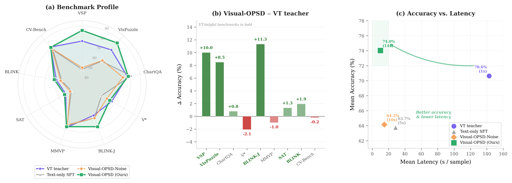
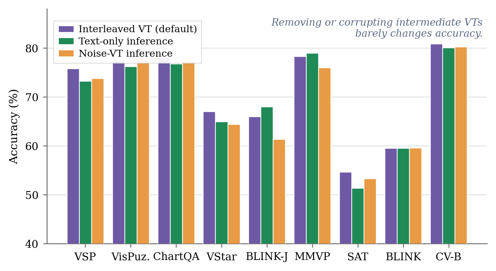
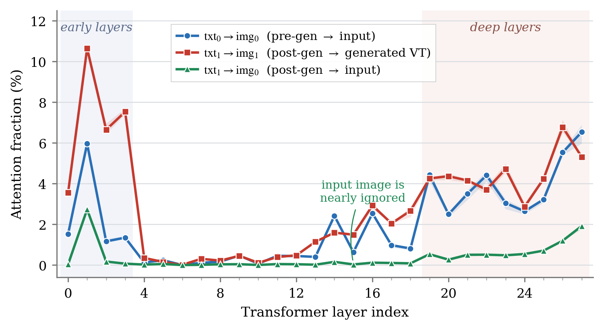
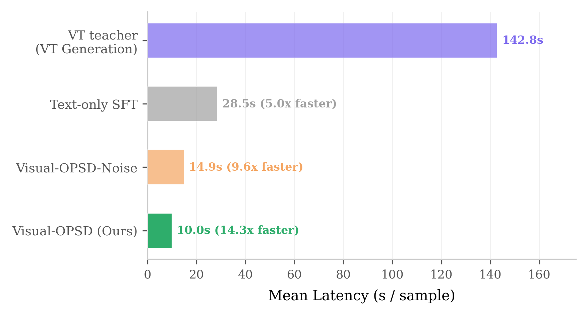

# Visual-OPSD: Cross-Modal On-Policy Self-Distillation for Efficient Unified Multimodal Reasoning

Code release for **Visual-OPSD**, a cross-modal on-policy self-distillation
framework that transfers the visual generation knowledge of a unified
multimodal model (UMM) into its text-only understanding pathway —
*without* paying the inference-time cost of generating intermediate
"visual thought" (VT) images.


*Figure 1 of the paper. (a) Visual-OPSD (green) matches or exceeds its
generative teacher (purple) on 6 of 9 benchmarks. (b) Per-benchmark gains
over the teacher; VT-helpful spatial tasks dominate. (c) Pareto-dominant
at 74.03 % / 10.0 s — a 14× speedup over the teacher.*

> **Status.** Pre-print release alongside the arXiv submission. The
> author list, project page, and pre-trained Visual-OPSD student
> checkpoints will be released here as those become public.

## Overview

Unified multimodal models such as
[BAGEL](https://github.com/ByteDance-Seed/Bagel) and
[ThinkMorph](https://github.com/ThinkMorph/ThinkMorph) can interleave
generated **visual thoughts** (VTs) with text reasoning — actual images
produced by multi-step diffusion that are spliced into the chain-of-
thought before the final answer. This improves spatial reasoning
substantially (+75pp on VSP over BAGEL), but each VT costs ~50 diffusion
steps, inflating per-sample inference latency by roughly 14×.

A pilot intervention on the frozen ThinkMorph teacher (paper Section 2)
shows that removing or corrupting the intermediate VTs barely changes
accuracy across all nine benchmarks, while a complementary attention
analysis on V\* shows that once a VT is rendered the subsequent
reasoning attends almost exclusively to that generated image and
ignores the original input:




Visual-OPSD therefore asks a different question: *does the generation
pathway encode reasoning knowledge that the understanding pathway
cannot recover on its own, and if so, can it be distilled cross-modally
inside the same model?*

The paper's answer is yes:

- **Teacher and student share identical weights**, but they differ in
  conditioning context. The teacher is fed a *strictly visual-only*
  privileged trace — the intermediate VT images, encoded by the same ViT
  the model already uses for understanding. The student sees only the
  problem image and the question.
- **Distillation is on-policy**. The student samples completions from
  its own current policy, and the teacher rescores the same tokens under
  the privileged VT context. The loss is a token-level Generalized
  Jensen-Shannon divergence on the shared completion span.
- **No new parameters, no architectural changes** — only a training
  objective. At inference the student is text-only and never invokes the
  diffusion pathway.

### Headline results (paper Table 2, 3-run average)

| Method | Avg (9 benchmarks) ↑ | Latency (s / sample) ↓ |
|---|---|---|
| ThinkMorph (VT teacher)              | 70.63    | 142.8 |
| Text-only SFT                         | 63.75    | 28.5  |
| Visual-OPSD-Noise (control)           | 64.15    | 14.9  |
| **Visual-OPSD (Ours)**                | **74.03** | **10.0** |
| Δ vs ThinkMorph                       | **+3.40 pp** | **14.3× faster** |
| Δ vs Text-only SFT                    | **+10.28 pp** | **2.9× faster** |



The Visual-OPSD-Noise control (real VT replaced with Gaussian noise of
matching shape) yields only +0.40pp over Text-only SFT, while Visual-
OPSD with real VT yields +10.28pp. A post-distillation KL analysis
shows that Visual-OPSD closes **58.4 %** of the teacher–student
distributional gap, against **3.5 %** for the noise control. Together
these two diagnostics confirm that the transferred signal originates
from the generation pathway's VT *semantic content* — not from generic
JSD regularization or from the surrounding privileged structure.

## Repository layout

```
Visual-OPSD/
├── README.md                       This file
├── INSTALL.md                      Environment setup walk-through
├── TRAIN.md                        Full training recipe + hyper-params
├── EVAL.md                         Evaluation protocol (uses VLMEvalKit-ThinkMorph)
├── LICENSE                         Apache 2.0 (inherited from BAGEL)
├── requirements.txt
├── download_model.py               Pull the base ThinkMorph-7B checkpoint
├── inferencer.py                   Interleaved (text + VT) inference engine
├── examples/
│   └── inference_demo.py           Minimal text-only inference example
├── docs/                           Paper figures bundled for the README
├── modeling/                       Unified model code (frozen from BAGEL/ThinkMorph)
│   ├── bagel/                        BAGEL wrapper + Qwen2-MoT fused decoder
│   ├── qwen2/                        Qwen2.5 LLM backbone
│   ├── siglip/                       SigLIP so400m NaViT vision encoder
│   ├── cache_utils/                  KV cache utilities
│   └── autoencoder.py                FLUX VAE wrapper (used only by interleaved inferencer)
├── data/
│   ├── configs/                    Training YAML configs
│   │   ├── visual_opsd.yaml          Main on-policy Visual-OPSD config
│   │   ├── visual_opsd_offline.yaml  Offline (cached-teacher) variant
│   │   ├── text_reasoning.yaml       Text-only SFT baseline
│   │   └── example.yaml              Template
│   ├── dataset_info.py             Dataset registry (edit / VISUAL_OPSD_DATA_ROOT)
│   ├── dataset_base.py             Packed-dataset machinery
│   ├── data_utils.py               Token packing + position-id helpers
│   ├── transforms.py               ViT / VAE image transforms
│   ├── visual_opsd_offline_dataset.py  Text-only student sequences (offline variant)
│   ├── opsd_paired_dataset.py      Raw-envelope iterable for on-policy Visual-OPSD
│   ├── opsd_pack_builder.py        Builds student / teacher packed batches
│   │                               (teacher channel is strictly visual-only)
│   ├── vlm_dataset.py              SFT / JSONL utilities
│   ├── t2i_dataset.py              T2I pretrain utilities
│   └── interleave_datasets/        Interleaved text+image datasets
├── train/                          Shared FSDP + checkpoint utilities
│   ├── fsdp_utils.py
│   └── train_utils.py
└── scripts/
    └── visual_opsd/                 Visual-OPSD experiment suite (see scripts/visual_opsd/README.md)
        ├── train_visual_opsd.py             Main on-policy Visual-OPSD trainer
        ├── train_visual_opsd_offline.py     Offline (cached-teacher) / SFT trainer
        ├── on_policy_sampler.py             Student sampler (FSDP-aware)
        ├── opsd_loss.py                     Generalized JSD + Tinker reverse-KL
        ├── kl_diagnostic.py                 KL diagnostic (Section 2.2 + Appendix I)
        ├── collect_traces.py                Pre-cache teacher logprobs (offline variant)
        ├── run_visual_opsd.sh               Main launcher (Visual-OPSD)
        ├── run_visual_opsd_noise.sh         Noise-control ablation
        ├── run_sft_baseline.sh              Text-only SFT
        ├── run_kl_diagnostic.sh             KL diagnostic launcher
        ├── run_collect_traces.sh            Cache teacher logprobs
        ├── run_visual_opsd_offline.sh       Offline Visual-OPSD trainer
        ├── run_sanity.sh                    Tiny sanity launcher
        └── test_*.py                        Smoke tests
```

## Quick start

### 1. Install

See [INSTALL.md](INSTALL.md) for a full walk-through. Short version:

```bash
git clone <repo-url> Visual-OPSD && cd Visual-OPSD
python -m pip install -U uv
uv venv --python 3.10
source .venv/bin/activate
uv pip install -r requirements.txt

# flash-attn must be installed as a prebuilt wheel matching your
# CUDA / PyTorch version, e.g. CUDA 12.6 + PyTorch 2.5:
pip install https://github.com/mjun0812/flash-attention-prebuild-wheels/releases/download/v0.0.8/flash_attn-2.5.9+cu126torch2.5-cp310-cp310-linux_x86_64.whl
```

### 2. Download the base ThinkMorph-7B checkpoint

```bash
python download_model.py            # → models/ThinkMorph-7B/
```

The base UMM (BAGEL-7B-MoT fine-tuned on interleaved CoT traces) is the
shared starting point for the Visual-OPSD teacher and student.

### 3. Prepare data

Visual-OPSD trains on the four reasoning datasets released with
ThinkMorph (`Visual_Search` / `Spatial_Navigation` / `Jigsaw_Assembly`
/ `Chart_Refocus`; 24,990 samples total). Each parquet record carries
`problem_image`, `question`, `reasoning_thought_*`, `reasoning_image_*`
(the VT images that become the teacher's privileged context), `answer`,
and `full_text_only_thought`.

Download from the [ThinkMorph Hugging Face
hub](https://huggingface.co/ThinkMorph) and place them under `datasets/`
(the default expected by `data/dataset_info.py`):

```
datasets/
├── Visual_Search/data/*.parquet
├── Spatial_Navigation/data/*.parquet
├── Jigsaw_Assembly/data/*.parquet
└── Chart_Refocus/data/*.parquet
```

Override the root by setting `VISUAL_OPSD_DATA_ROOT=/path/to/datasets`, or edit
the path helpers in [`data/dataset_info.py`](data/dataset_info.py).
Each dataset folder must contain a `data/` subdirectory with parquet
shards.

### 4. Train

| Step | Command | Notes |
|---|---|---|
| KL diagnostic (Section 2.2) | `bash scripts/visual_opsd/run_kl_diagnostic.sh` | Verifies that the VT context measurably shifts the frozen base model's completion distribution (paper: K<sub>gen</sub> ≈ 4.64 nats/token across 1k samples). |
| Text-only SFT baseline | `bash scripts/visual_opsd/run_sft_baseline.sh` | Reproduces the Text-only SFT row of Table 2. |
| **Visual-OPSD (main)** | `bash scripts/visual_opsd/run_visual_opsd.sh` | On-policy Visual-OPSD with EMA teacher, β=0.5, top-K=256, token-clip=0.05. |
| Visual-OPSD-Noise (ablation) | `bash scripts/visual_opsd/run_visual_opsd_noise.sh` | Replaces real VT images with Gaussian noise in the teacher context. |

All scripts launch with `torchrun` and assume an Arnold-style worker
environment (`ARNOLD_WORKER_*` env vars). Adapt the launcher header for
your scheduler. The paper's reported checkpoint is at **1,000 steps**;
the default `TOTAL_STEPS` in the launchers is 2,000 — pass `1000` as
the sixth positional argument to reproduce the paper exactly:

```bash
bash scripts/visual_opsd/run_visual_opsd.sh models/ThinkMorph-7B ema 0.5 1.0 1.0 1000
```

See [TRAIN.md](TRAIN.md) for the full hyperparameter table and a
reproduction protocol.

### 5. Inference

Visual-OPSD students are pure text-only models — they never invoke the
diffusion pathway at inference, so you do not need the VAE.

```bash
python examples/inference_demo.py \
    --model_path results/visual-opsd-ema-beta0.5/checkpoints/0001000 \
    --image path/to/problem.jpg \
    --question "..."
```

For full interleaved inference (text + generated VT) with the base
ThinkMorph teacher, see [`inferencer.py`](inferencer.py) — the
`InterleaveInferencer.interleave_inference` entry point matches the
original BAGEL / ThinkMorph API.

### 6. Evaluation

We use the open-source
[VLMEvalKit-ThinkMorph](https://github.com/hychaochao/VLMEvalKit_Thinkmorph)
evaluation harness, which already supports all nine benchmarks reported
in the paper (`VSP`, `VisPuzzle`, `ChartQA`, `VStar`, `BLINK-J`, `MMVP`,
`SAT`, `BLINK`, `CV-Bench`). See [EVAL.md](EVAL.md) for the protocol
used in the paper (greedy decoding, max 1,024 tokens, single H800,
batch size 1).

## Method at a glance

```
┌──────────── Privileged teacher context (training only) ────────────┐
│  system │ ViT(img) │ question │ <ref_intro>                        │
│         │          │          │ ViT(VT_1) ViT(VT_2) ...            │
│         │          │          │ <transition> │ student_completion  │
└────────────────────────────────────────────────────────────────────┘
                                                  │ (no grad, EMA)
                                                  ▼
                                            teacher_logits

┌──────────── Student context ─────────────────────────────────────┐
│  system │ ViT(img) │ question │ student_completion               │
└──────────────────────────────────────────────────────────────────┘
                                                  │ (grad)
                                                  ▼
                                            student_logits

L = jsd_weight · generalizedJSD_β=0.5(student_logits, teacher_logits)
        + ce_weight · CE(student, completion)        # ce_weight=0 by default
```

- The teacher's privileged channel is **strictly visual-only**: only
  the VT images appear, not the text thoughts or the ground-truth
  answer. The teacher does not need to be "stronger"; it merely
  possesses more visual information.
- `student_completion` is sampled from the **current** student weights
  every step (on-policy), using `FSDP.summon_full_params` so each rank
  can run BAGEL's batched inference primitives.
- The teacher is the same model as the student, conditioned differently.
  Three teacher modes are supported via `--teacher_mode`:
  `self` (no-grad twin), `ema` (default, decay 0.995), or `fixed`
  (frozen initial checkpoint).
- JSD supports β interpolation, top-K restriction (paper uses K=256),
  per-token clipping (paper uses τ=0.05), and an optional Tinker
  reverse-KL variant — all in
  [`scripts/visual_opsd/opsd_loss.py`](scripts/visual_opsd/opsd_loss.py).

A self-contained walk-through with launcher options is in
[`scripts/visual_opsd/README.md`](scripts/visual_opsd/README.md), and the step-by-step
pseudocode is in **Algorithm 1** (Appendix C) of the paper.

## What this repo includes / excludes

**Included.** Full training and inference code for the on-policy
Visual-OPSD trainer (`train_visual_opsd.py`), the offline (cached-
teacher) variant (`train_visual_opsd_offline.py`), the SFT baseline,
the Visual-OPSD-Noise control, the
KL diagnostic, and supporting data utilities. The underlying UMM
architecture (BAGEL + Qwen2-MoT + SigLIP NaViT) is inherited unchanged
from the upstream
[BAGEL](https://github.com/ByteDance-Seed/Bagel) and
[ThinkMorph](https://github.com/ThinkMorph/ThinkMorph) releases.

**Not included.**

- The paper itself (under review).
- Training and evaluation datasets — please download them separately
  from the [ThinkMorph Hugging Face hub](https://huggingface.co/ThinkMorph).
- The base ThinkMorph-7B checkpoint — fetched separately via
  [`download_model.py`](download_model.py).
- Pre-trained Visual-OPSD student checkpoints — released upon paper
  acceptance.
- Evaluation harness — we use the open-source
  [VLMEvalKit-ThinkMorph](https://github.com/hychaochao/VLMEvalKit_Thinkmorph),
  which already supports all 9 benchmarks reported in the paper.

## Hardware

- 8 × NVIDIA H800 (80 GB) for full-rank on-policy Visual-OPSD training;
  FSDP HYBRID_SHARD with activation checkpointing and gradient
  accumulation keep peak memory under 70 GB / GPU.
- The on-policy sampler runs on each rank inside
  `FSDP.summon_full_params`, so the effective student copy must fit in
  a single GPU's memory at sampling time (it does, with the optimizer
  state CPU-offloaded; see Appendix C of the paper).
- A single 80 GB GPU is enough for inference and the KL diagnostic.

## Acknowledgements

This repository builds on the open-source releases of
[BAGEL](https://github.com/ByteDance-Seed/Bagel) and
[ThinkMorph](https://github.com/ThinkMorph/ThinkMorph), which provide
the unified-model architecture and the interleaved reasoning trace
datasets that Visual-OPSD trains on. The on-policy self-distillation
recipe is in the same family as the OPSD family (text-only OPSD,
long-context OPSDL, and visual-crop Vision-OPD); Visual-OPSD differs
from these by being the first OPSD instance to bridge a generation–
understanding gap within a single unified multimodal model. The
generalized JSD formulation is the one popularised by
[Agarwal et al., GKD](https://arxiv.org/abs/2306.13649). All upstream
licences (Apache 2.0) are preserved.

## License

Apache License 2.0 — see [LICENSE](LICENSE).

## Citation

```bibtex
@article{visualopsd2026,
  title   = {Visual-OPSD: Cross-Modal On-Policy Self-Distillation for
             Efficient Unified Multimodal Reasoning},
  author  = {Anonymous Authors},
  journal = {arXiv preprint},
  year    = {2026},
}
```

The author list and arXiv ID will be filled in once the pre-print is
public.
